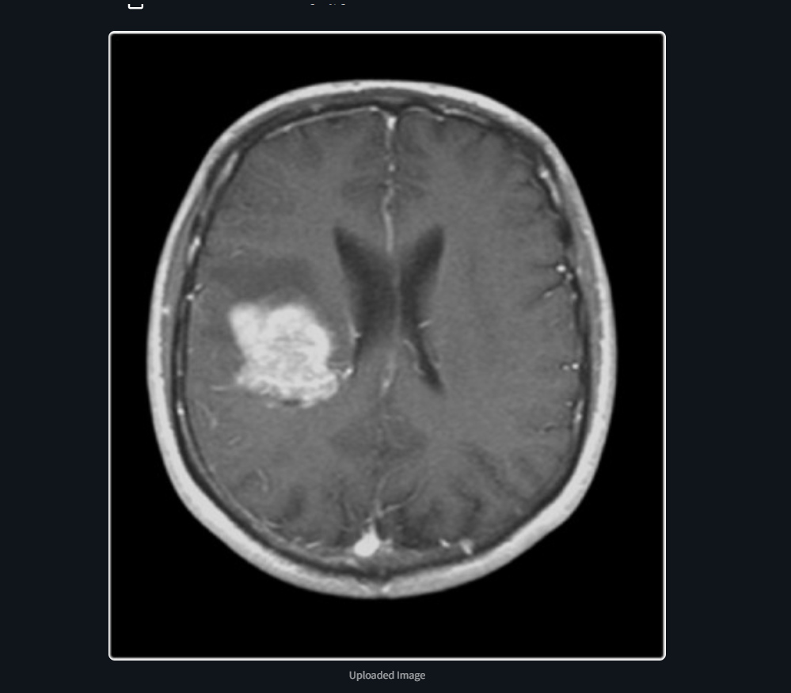
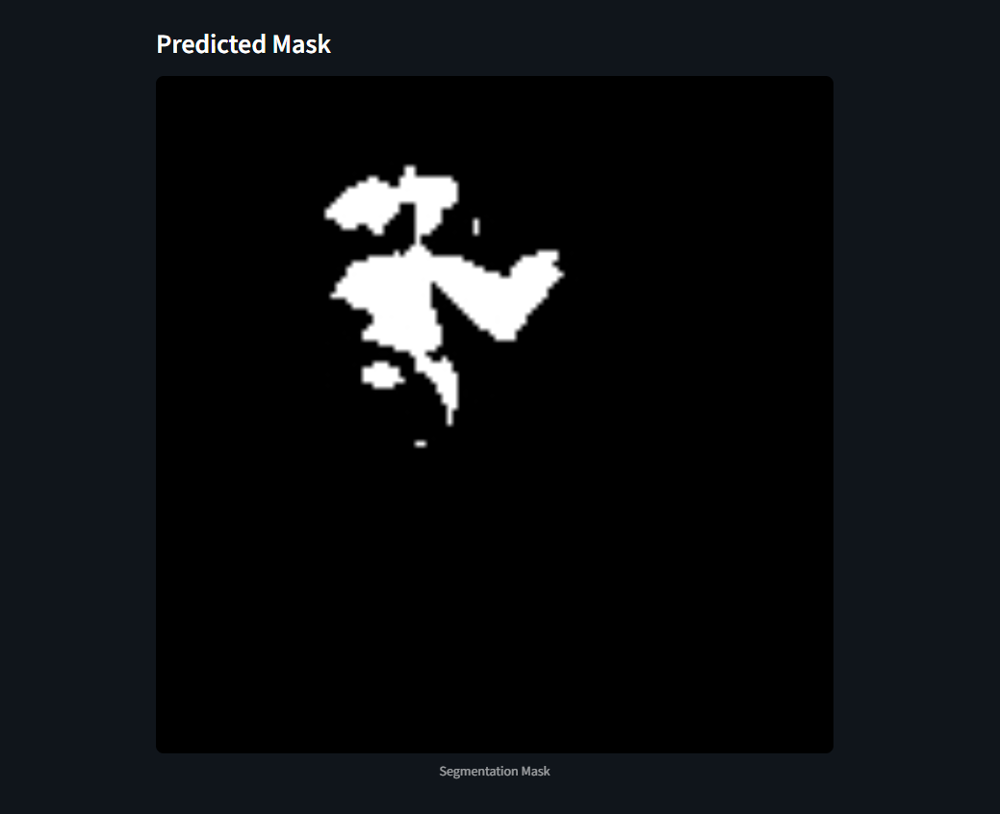

# U-Net for Brain MRI Segmentation

A professional PyTorch implementation of the U-Net architecture for medical image segmentation, specifically designed for brain MRI tumor segmentation using the LGG dataset. This repository serves as both a complete implementation and an educational resource for deep learning practitioners interested in medical imaging applications.

## Features

* **Clean U-Net Architecture**: Modular PyTorch implementation with configurable depth and channels
* **Advanced Loss Function**: Combined weighted Binary Cross-Entropy and Dice loss for optimal segmentation
* **Comprehensive Pipeline**: End-to-end training, validation, and inference workflows
* **Interactive Learning**: Jupyter notebooks with detailed explanations and visualizations
* **Production Ready**: Pretrained model checkpoints and deployment utilities
* **Extensive Metrics**: Dice coefficient, IoU, accuracy, and custom segmentation metrics

## Project Structure

```
unet-brain-mri/
├── notebooks/              # Interactive tutorials and analysis
│   ├── 01_brain-mri-semantic-segmentation.ipynb
│   └── 02_UNet.ipynb
├── src/                    # Core implementation
│   ├── models/
│   │   └── unet_model.py   # U-Net architecture
│   ├── data/
│   │   └── data_loader.py  # Dataset utilities and transforms
│   ├── training/
│   │   └── train.py        # Training pipeline
│   ├── utils/
│   │   ├── metrics.py      # Evaluation metrics
│   │   └── visualization.py # Plotting utilities
│   └── main.py             # CLI entry point
├── assets/                 # Sample results and documentation
│   ├── assets1.png         # Input MRI sample
│   └── assets2.png         # Segmentation mask sample
├── models/                 # Saved model checkpoints
│   └── best_model.pth
├── requirements.txt        # Project dependencies
├── setup.py               # Package configuration
├── .gitignore
└── README.md
```

## Installation

### Prerequisites
- Python 3.8+
- CUDA-compatible GPU (recommended)
- 8GB+ RAM

### Quick Start

```bash
# Clone the repository
git clone https://github.com/<your-username>/unet-brain-mri.git
cd unet-brain-mri

# Create virtual environment (recommended)
python -m venv venv
source venv/bin/activate  # On Windows: venv\Scripts\activate

# Install dependencies
pip install -r requirements.txt

# Optional: Install in development mode
pip install -e .
```

### Docker Installation (Alternative)

```bash
docker build -t unet-brain-mri .
docker run -it --gpus all unet-brain-mri
```

## Dataset

This project utilizes the **LGG Brain MRI Segmentation** dataset from Kaggle:
- **Source**: https://www.kaggle.com/datasets/mateuszbuda/lgg-mri-segmentation
- **Size**: 3,929 brain MRI images with corresponding tumor masks
- **Format**: 256x256 grayscale images with binary segmentation masks

**Setup Instructions**:
1. Download the dataset from Kaggle
2. Extract to `data/lgg-mri-segmentation/`
3. Run the preprocessing notebook for data validation

## Usage

### Interactive Learning (Recommended for Beginners)

Explore the step-by-step notebooks in the `notebooks/` directory:

```bash
jupyter lab notebooks/
```

### Command Line Interface

**Training from scratch**:
```bash
python src/main.py train \
    --data-path data/lgg-mri-segmentation \
    --epochs 50 \
    --batch-size 16 \
    --learning-rate 1e-4 \
    --save-dir models/
```

**Inference with pretrained model**:
```bash
python src/main.py predict \
    --model-path models/best_model.pth \
    --input-image path/to/mri.png \
    --output-mask path/to/predicted_mask.png
```

**Model evaluation**:
```bash
python src/main.py evaluate \
    --model-path models/best_model.pth \
    --test-data data/test/
```

## Results

### Model Performance
- **Validation Loss**: 0.1923
- **Dice Coefficient**: 0.847
- **IoU Score**: 0.735
- **Pixel Accuracy**: 98.57%

### Sample Predictions

| Input MRI | Segmentation Result |
|:---------:|:-------------------:|
|  |  |

*Figure: Brain MRI segmentation showing tumor region identification*

## Technical Details

### Architecture
- **Encoder**: 4-level contracting path with 3x3 convolutions
- **Decoder**: 4-level expansive path with transpose convolutions  
- **Skip Connections**: Feature concatenation for precise localization
- **Output**: Single-channel probability map with sigmoid activation

### Loss Function
The model employs a hybrid loss function optimized for medical segmentation:

```python
total_loss = α × BCE_loss + β × Dice_loss
# Where α=0.7, β=0.3 (empirically optimized)
```

- **Binary Cross-Entropy**: Pixel-wise classification with class weighting
- **Dice Loss**: Overlap-based metric for better boundary detection

### Training Strategy
- **Optimizer**: Adam with weight decay (1e-4)
- **Scheduler**: ReduceLROnPlateau with patience=10
- **Augmentation**: Random rotation, flipping, and intensity variation
- **Early Stopping**: Validation loss monitoring with patience=20

## Contributing

We welcome contributions! Please see our [Contributing Guidelines](CONTRIBUTING.md) for details.

1. Fork the repository
2. Create a feature branch
3. Add tests for new functionality
4. Submit a pull request

## References

- **Ronneberger, O., Fischer, P., & Brox, T.** (2015). U-Net: Convolutional Networks for Biomedical Image Segmentation. *MICCAI 2015*.
- **Mateusz Buda et al.** Association of genomic subtypes of lower-grade gliomas with shape features automatically extracted by a deep learning algorithm. *Computers in Biology and Medicine*, 2019.

## License

This project is licensed under the MIT License - see the [LICENSE](LICENSE) file for details.

## Citation

If you use this implementation in your research, please cite:

```bibtex
@software{unet_brain_mri,
  title={U-Net for Brain MRI Segmentation},
  author={Wahb Mohamed},
  year={2025},
  url={https://github.com/WahbMohamed2/BrainMRI-Segementation}
}
```
